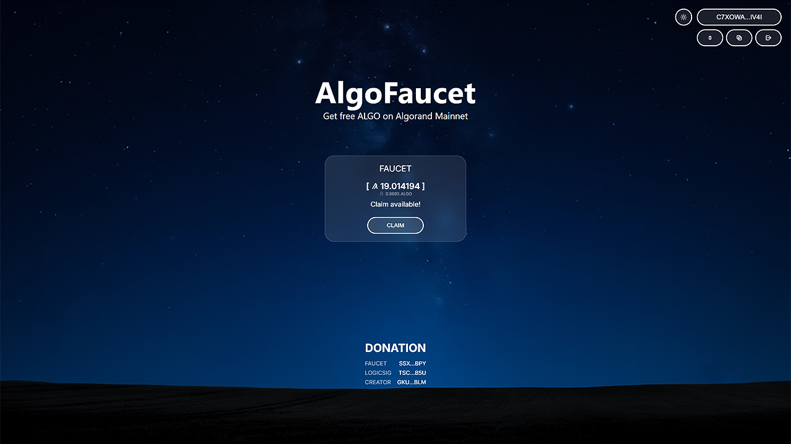

# AlgoFaucet

AlgoFaucet is a decentralized faucet on Algorand Mainnet that lets users claim ALGO with zero-fee transactions.



## Features

- Zero-fee claims for users — innovative LogicSig fee payment mechanism
- Multi-wallet support (Pera, Defly, Lute)
- Responsive web interface for desktop and mobile

## Links

- Web Interface: [AlgoFaucet.org](https://algofaucet.org)
- Mainnet Contract: App ID `3054946205`

## Dev

```bash
npm install
cp env.example .env
npm run dev
```

## Build

```bash
npm run build
npm run preview
```

## License

MIT — see `LICENSE`.


